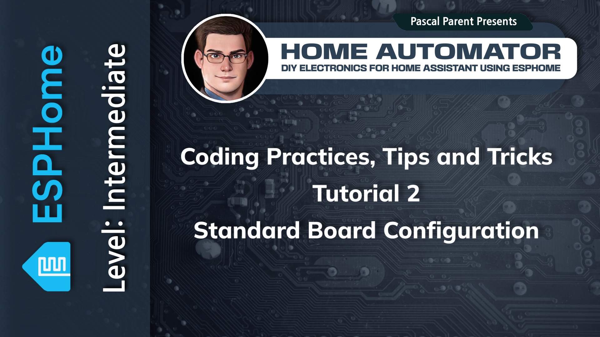

# ESPHome, Coding practices, tips and tricks, Tutorial 2, Standard Board Configuration

This series of tutorials is specifically designed for intermediate ESPHome users who have already completed my tutorial on "Creating a Room Sensor from Scratch" and are looking to take their skills to the next level.

In this tutorial, we will discuss the standard common modules, settings, wi-fi, web server and bluetooth.

## Video

## Code

You will find all the code files in the [ESPHOME](/Coding_Practices_Tips_and_Tricks/2_standard_board_configurations/ESPHOME/) directory. I have only included the directory that have changed, so you can carry the directory structure from the last tutorial.

## Comments Template

    ################################################################################
    # Hardware: DTH11/22 Temperature and Humidity Sensor
    ################################################################################
    # Reference(s): https://esphome.io/...
    # -----------------------------------------------------------------------------  
    # Usage:
    #   Include the following code in the package section of the device file, 
    #   adjusting the data pin and model number.
    # -----------------------------------------------------------------------------
    # packages:
    #  dht: !include 
    #    file: sensors/digital/dht22.yaml
    #    vars:
    #      data_pin: GPIO26
    #      model: DHT22
    # -----------------------------------------------------------------------------      
    # Notes:
    #      - Uses the fpollowing substitutions from the project file:
    #        - device_internal_name
    #        - device_sampling_time
    ################################################################################

## Entity Property Standards

    - id
    - name
    - icon
    - ...
    - lambda
    - filters
    - unit_of_measurement 
    - update_interval 
    - device_class
    - entity_category
    - internal
    - disabled_by_default
    - web_server_sorting_weight
    - automations

## Other useful or mentioned links

- [Tutorial 1 - Foundation - Part 1](https://youtu.be/G9WRg6jk7xk)
- [Tutorial 1 - Foundation - Part 2](https://youtu.be/Qx6hqZh4Y9s)
- [Configuration type on ESPHome](https://esphome.io/guides/configuration-types.html)
- [Let's rework our Room Sensor Package Code!](https://youtube.com/live/52_ZJmTz3bs)
- [Let's build a room sensor - Part 0](/Lets_build_a_room_sensor/Part%200/README.md)
- [Installing and configuring Home Assistant](/Tutorial%201%20-%20Basic%20Setup%20for%20all%20Devices/README.md)
- [Let's install the ESPHome Add-on](https://youtu.be/zwykvV82SGw?si=XLMDUKdHiqi_dprt)
- [Let's install the Studio Code Add-on](https://youtu.be/oKdITXid-5Y)
- [Let's install the Samba Share Add-On](https://youtu.be/Vu_oxefjd0I)
- [Lat's install Microsoft Visual Studio Code Desktop](https://youtu.be/6NdY1y3NYL8)
